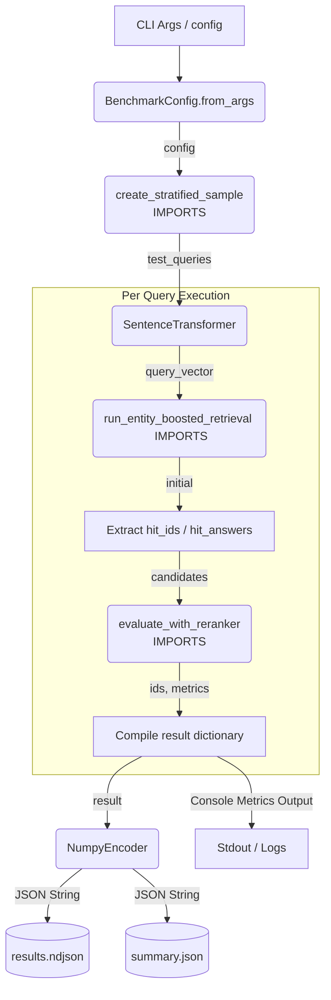

# Reranker Benchmarking Pipeline

An automated, fault-tolerant execution rig built to benchmark and measure the retrieval accuracy and processing latency of multiple cross-encoder reranking strategies against a localized Qdrant database.

<table>
<tr>
<td width="45%" valign="top">

### System Data Flow

</td>
<td width="55%" valign="top">

### Core Architecture & Execution Steps

* **Initialization & Guard Rails:**
  * Parses command-line arguments to establish dynamic sample sizes and target evaluation models.
  * Executes an upfront dimension guard validation to verify vector compatibility between embedding engines and dense collections before starting long-running loops.
  * Reuses a unified, persistent connection socket for the vector engine client to eliminate network authentication and handshake penalties on each loop pass.

* **Resiliency & State Hydration:**
  * Reads existing data files streaming out of standard Line-Delimited JSON formats (`.ndjson`) to automatically register historically processed queries.
  * Dynamically drops previously computed entries out of active iteration tracks to handle processing timeouts or pipeline crashes on free-tier infrastructure.

* **Multi-Stage Retrieval Loop:**
  * Presents raw incoming strings to a local transformer instance to calculate semantic vector structures.
  * Pays the database retrieval latency cost exactly once by pulling wide, inflated candidate sets using an isolated vector lookup framework.
  * Transforms raw matching artifacts into structured object arrays containing precise payload metadata targets.
  * Feeds candidates across an array of isolated rerankers to extract final optimized lists along with internal calculation latency metrics.

* **Metric Computations & Analytics:**
  * Aggregates system scores by tracking the exact index position of expected items through Mean Reciprocal Rank formulas.
  * Calculates overall system hit consistency rates utilizing strict threshold parameters.
  * Strips out complex numeric array datatypes via localized encoding adapters to emit flat serialization summaries across text storage systems.
  * Slices latency results across specific domain tags to diagnose edge cases where specific semantic categories cause calculation delays.

</td>
</tr>
</table>
