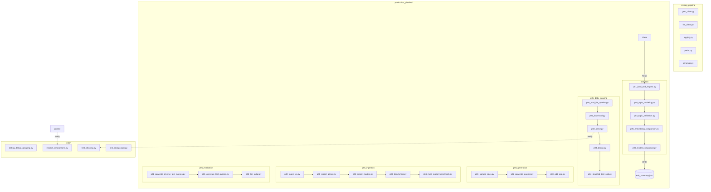

```mermaid
flowchart TD
    subgraph Core[src/rag_pipeline]
    gem_client[gem_client.py]
    llm_client[llm_client.py]
    logging[logging.py]
    paths[paths.py]
    schemas[schemas.py]
    end
    subgraph Stages[production_pipeline/]
        direction LR
        subgraph p01_data_cleaning[p01_data_cleaning]
        p01_data_cleaning_p00_load_llm_queries[p00_load_llm_queries.py]
        p01_data_cleaning_p01_download[p01_download.py]
        p01_data_cleaning_p00_load_llm_queries --> p01_data_cleaning_p01_download
        p01_data_cleaning_p02_parse[p02_parse.py]
        p01_data_cleaning_p01_download --> p01_data_cleaning_p02_parse
        p01_data_cleaning_p03_dedup[p03_dedup.py]
        p01_data_cleaning_p02_parse --> p01_data_cleaning_p03_dedup
        p01_data_cleaning_p04_stratified_test_split[p04_stratified_test_split.py]
        p01_data_cleaning_p03_dedup --> p01_data_cleaning_p04_stratified_test_split
        end
        subgraph p02_eda[p02_eda]
        p02_eda_p01_load_and_inspect[p01_load_and_inspect.py]
        p02_eda_p02_topic_modeling[p02_topic_modeling.py]
        p02_eda_p01_load_and_inspect --> p02_eda_p02_topic_modeling
        p02_eda_p03_topic_validation[p03_topic_validation.py]
        p02_eda_p02_topic_modeling --> p02_eda_p03_topic_validation
        p02_eda_p05_embedding_comparison[p05_embedding_comparison.py]
        p02_eda_p03_topic_validation --> p02_eda_p05_embedding_comparison
        p02_eda_p06_model_comparison[p06_model_comparison.py]
        p02_eda_p05_embedding_comparison --> p02_eda_p06_model_comparison
        end
        Clean -->|Read| p02_eda_p01_load_and_inspect
        p02_eda_p06_model_comparison -->|Write| Summary[(eda_summary.json)]
        subgraph p03_generation[p03_generation]
        p03_generation_p01_sample_docs[p01_sample_docs.py]
        p03_generation_p02_generate_queries[p02_generate_queries.py]
        p03_generation_p01_sample_docs --> p03_generation_p02_generate_queries
        p03_generation_p03_add_ood[p03_add_ood.py]
        p03_generation_p02_generate_queries --> p03_generation_p03_add_ood
        end
        subgraph p04_ingestion[p04_ingestion]
        p04_ingestion_p00_ingest_es[p00_ingest_es.py]
        p04_ingestion_p00_ingest_qdrant[p00_ingest_qdrant.py]
        p04_ingestion_p00_ingest_es --> p04_ingestion_p00_ingest_qdrant
        p04_ingestion_p02_ingest_models[p02_ingest_models.py]
        p04_ingestion_p00_ingest_qdrant --> p04_ingestion_p02_ingest_models
        p04_ingestion_p03_benchmark[p03_benchmark.py]
        p04_ingestion_p02_ingest_models --> p04_ingestion_p03_benchmark
        p04_ingestion_p04_multi_model_benchmark[p04_multi_model_benchmark.py]
        p04_ingestion_p03_benchmark --> p04_ingestion_p04_multi_model_benchmark
        end
        subgraph p05_evaluation[p05_evaluation]
        p05_evaluation_p01_generate_diverse_test_queries[p01_generate_diverse_test_queries.py]
        p05_evaluation_p01_generate_test_queries[p01_generate_test_queries.py]
        p05_evaluation_p01_generate_diverse_test_queries --> p05_evaluation_p01_generate_test_queries
        p05_evaluation_p05_llm_judge[p05_llm_judge.py]
        p05_evaluation_p01_generate_test_queries --> p05_evaluation_p05_llm_judge
        end
    end
    subgraph Tests[tests/]
    debug_dedup_grouping[debug_dedup_grouping.py]
    inspect_comparisons[inspect_comparisons.py]
    test_cleaning[test_cleaning.py]
    test_dedup_logic[test_dedup_logic.py]
    end
    p01_data_cleaning_p02_parse -.->|Verify| test_cleaning
    parsed -.->|Verify| inspect_comparisons
```