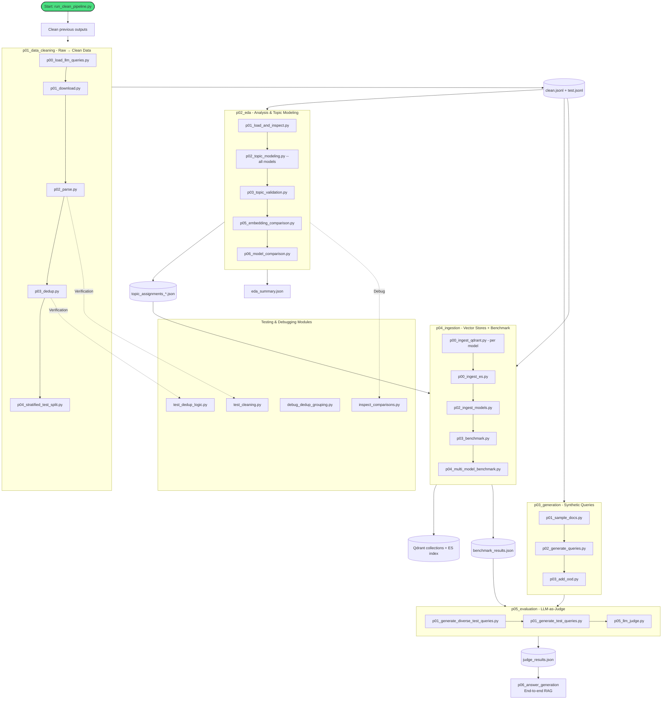

```mermaid
flowchart TD
    %% ==================== START ====================
    Start([Start: run_clean_pipeline.py]) 
    --> CleanOutputs[Clean previous outputs]

    %% ==================== MAIN PRODUCTION FLOW ====================
    CleanOutputs --> p01[p01_data_cleaning]

    subgraph p01 [p01_data_cleaning - Raw → Clean Data]
        direction TB
        p01_00[p00_load_llm_queries.py]
        p01_01[p01_download.py]
        p01_02[p02_parse.py]
        p01_03[p03_dedup.py]
        p01_04[p04_stratified_test_split.py]
        
        p01_00 --> p01_01 --> p01_02 --> p01_03 --> p01_04
    end

    p01 --> CleanData[(clean.jsonl + test.jsonl)]

    %% EDA & Analysis
    CleanData --> p02[p02_eda]

    subgraph p02 [p02_eda - Analysis & Topic Modeling]
        direction TB
        p02_01[p01_load_and_inspect.py]
        p02_02[p02_topic_modeling.py --all models]
        p02_03[p03_topic_validation.py]
        p02_05[p05_embedding_comparison.py]
        p02_06[p06_model_comparison.py]
        
        p02_01 --> p02_02 --> p02_03 --> p02_05 --> p02_06
    end

    p02 --> Topics[(topic_assignments_*.json)]
    p02 --> EDA[eda_summary.json]

    %% Generation (optional but used for test sets)
    CleanData --> p03[p03_generation]

    subgraph p03 [p03_generation - Synthetic Queries]
        direction TB
        p03_01[p01_sample_docs.py]
        p03_02[p02_generate_queries.py]
        p03_03[p03_add_ood.py]
        p03_01 --> p03_02 --> p03_03
    end

    %% Ingestion & Benchmarking
    Topics --> p04
    CleanData --> p04

    subgraph p04 [p04_ingestion - Vector Stores + Benchmark]
        direction TB
        p04_00q[p00_ingest_qdrant.py - per model]
        p04_00es[p00_ingest_es.py]
        p04_02[p02_ingest_models.py]
        p04_03[p03_benchmark.py]
        p04_04[p04_multi_model_benchmark.py]
        
        p04_00q --> p04_00es
        p04_00es --> p04_02 --> p04_03 --> p04_04
    end

    p04 --> VectorStores[(Qdrant collections + ES index)]
    p04 --> Benchmarks[(benchmark_results.json)]

    %% Evaluation
    Benchmarks --> p05
    p03 --> p05

    subgraph p05 [p05_evaluation - LLM-as-Judge]
        p05_01a[p01_generate_diverse_test_queries.py]
        p05_01[p01_generate_test_queries.py]
        p05_05[p05_llm_judge.py]
        p05_01a --> p05_01 --> p05_05
    end

    p05 --> JudgeResults[(judge_results.json)]

    %% Final stage
    JudgeResults --> p06[p06_answer_generation<br/>End-to-end RAG]

    %% ==================== TESTING / DEBUG ====================
    subgraph Testing[Testing & Debugging Modules]
        direction TB
        test_cleaning[test_cleaning.py]
        test_dedup[test_dedup_logic.py]
        debug_dedup[debug_dedup_grouping.py]
        inspect[inspect_comparisons.py]
    end

    p01_02 -.->|Verification| test_cleaning
    p01_03 -.->|Verification| test_dedup
    p02 -.->|Debug| inspect

    style Start fill:#4ade80,stroke:#000
```